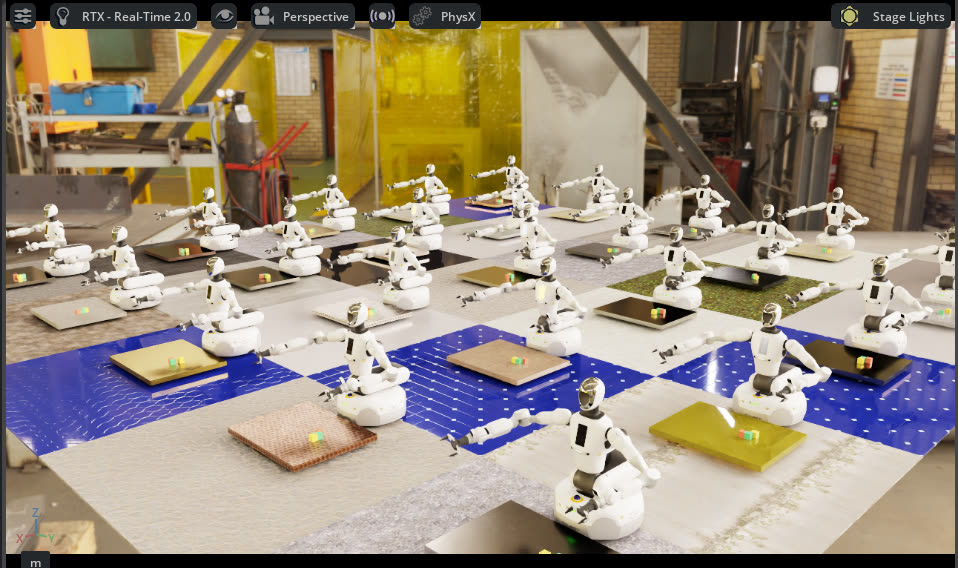

# ioailab

ioailab provides G1 robot cfgs, an IsaacLab-style task registry, action/sensor
helpers, dataset refs, and action agents for IsaacLab.



## Quick Start

Build once and enter the GUI container (also the GP001 teleop shell):

```bash
make build
make shell-gui
```

`make_env(...)` handles app launch, task registration, and env construction in
one call. Agents return full action tensors, and `env.collect(...)` records data
through IsaacLab's recorder manager:

```python
from ioailab.agents import CuroboPlannerAgent
from ioailab.envs import make_env

task_id = "GalbotG1-PickCube-v0"
env = make_env(task_id, num_envs=1)
agent = CuroboPlannerAgent.from_task(task_id)

dataset = env.collect(
    agent=agent,
    episodes=1,
    path="data/pick_cube_demos.hdf5",
)
env.close()
```

`env.collect(...)` exports data only when the env reports terminated/truncated
or when the caller's `max_steps` limit is reached. `env.is_running()` is only
the Isaac app-lifecycle guard.

The data pipeline (collect → Mimic → train → evaluate) runs as separate
processes so IsaacSim state never leaks across stages:

```bash
python examples/01_collect.py   # collect motion-planner data; teleop is shown in comments
python examples/02_mimic.py     # mimic(dataset, episodes=...) expansion
python examples/03_train.py     # train robomimic_diffusion with RobomimicDiffusionTrainCfg
python examples/04_eval.py --checkpoint outputs/pick_cube/model_best_training.pth --headless
```

Use `examples/06_collect_component_task.py` for PickToShelf/SortToShelf
component-task data, and `examples/07_compound_task.py` for coherent task runs.
For motion-planning examples, use cuRobo v2 (`curobov2`). Registered task IDs
and the rest of the workflow live in the docs below.

## Traditional Vision Baseline

YOLO and FoundationPose workflows live under
[`examples/vision_baseline/`](examples/vision_baseline/). See
[YOLO setup](docs/yolo_seg.md); FoundationPose setup is documented in the
vision-baseline script headers.

## 📖 Documentation

Detailed documentation can be found at:

[Online Documentation](https://galbot-ioai.github.io/ioailab/)

| Topic | Page |
| --- | --- |
| Tutorial | [docs/tutorial.md](docs/tutorial.md) |
| Examples | [docs/examples.md](docs/examples.md) |
| Architecture | [docs/architecture.md](docs/architecture.md) |
| Action agents & task flows | [docs/agents.md](docs/agents.md) |
| Tasks | [docs/tasks.md](docs/tasks.md) |
| Data & datasets (Mimic, LeRobot v3) | [docs/data.md](docs/data.md) |
| Sensors and cameras | [docs/galbot_sensors.md](docs/galbot_sensors.md) |
| Robot reference (joints, assets) | [docs/reference.md](docs/reference.md) |
| Development workflow | [docs/development.md](docs/development.md) |

Architecture-sensitive work should follow `AGENTS.md` and
[docs/architecture.md](docs/architecture.md).
