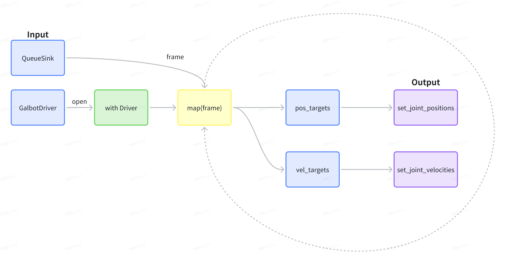
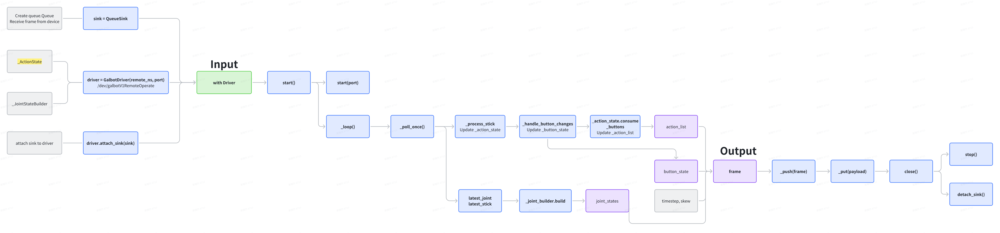
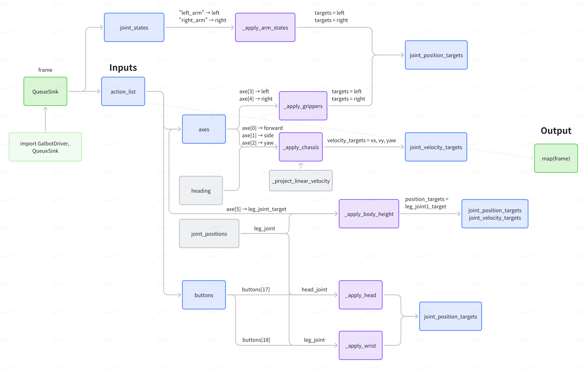

# remote_control_lite: Standalone Teleop Arm Reader

remote_control_lite 是一个与 ROS 解耦的最小遥操臂读取库。它通过串口接入硬件遥操臂，解析左右臂 7DoF 的关节数据，并在 Python 中以多种通信方式（Queue、SharedMemory、UDP）分发，支持同进程与多进程消费，以及软时间同步的 14 关节合并快照。

## Quick Start
- 安装（开发模式）：
  - `pip install -e .`
- 运行示例：
  - `python -m remote_control_lite.examples.basic_usage --port /dev/galbotV1RemoteOperate`
- 简单使用：
  - 单臂队列：`q = driver.subscribe_queue()`；`q.get()` 返回单臂样本（side/position/...）
  - 合并快照：`q = driver.subscribe_combined(window_sec=0.02)`；得到 14 关节同步样本
  - 共享内存：`shm = driver.add_shared_memory()`；`shm.name` 供他进程映射读取
  - UDP：`driver.add_udp_sink(host, port)` 广播 JSON 载荷

## Key Features
- C++/pybind11 与 Python 结合：硬件回调在 C++ 侧解析，Python 侧统一分发
- 多种 sink：Queue（进程内）、SharedMemory（跨进程，低延迟）、UDP（跨主机广播）
- 左右臂软同步：设定窗口（默认 20ms），合并输出 14 关节快照
- 可扩展：自定义 sink 只需实现 `publish(payload)`

## Directory Layout
- `src/remote_control_lite/`：Python 包与预编译依赖（libs）
- `cpp/`：C++ 设备封装与 pybind11 绑定
- `third_party/include/`：3rd 头文件（只用于编译）
- `examples/`：用法示例（Queue/SharedMemory/UDP/Combined）
- `tests/`：无硬件单测（结构验证）
- `docs/`：设计文档与参考手册

## Documentation
- Overview: `docs/overview.md`
- Data Structures & Flow: `docs/data_flow.md`
- Time Sync: `docs/time_sync.md`
- Hardware Protocol & Commands: `docs/hardware_protocol.md`
- Sinks & Scenarios: `docs/sinks.md`
- 关系与深入：`docs/remote_control_relation.md`（本库与 remote_control 的关系与原理）

## Examples
- Queue (single process): `python examples/queue_single_process.py --port /dev/galbotV1RemoteOperate`
- Shared memory (multi-process):
  - Terminal A: `python examples/shm_writer.py --port /dev/galbotV1RemoteOperate`
  - Copy printed name, then Terminal B: `python examples/shm_reader.py --name <printed-name>`
- UDP broadcast:
  - Receiver: `python examples/udp_receiver.py --port 9999`
  - Sender: `python examples/udp_sender.py --port /dev/galbotV1RemoteOperate --udp 9999`
- Joystick monitor:
  - `python examples/joystick_monitor.py --port /dev/galbotV1RemoteOperate`

## Notes
- 预编译 `.so` 当前为 x86_64，如为其他架构请替换 `src/remote_control_lite/libs/*.so`
- 默认串口为 `/dev/galbotV1RemoteOperate`，请根据实际设备调整

## Process
- Overview: 总体概括该库被调用到Physics Simulator中teleoperation代码的全过程

- Update Data to Frame: 打开Driver的QueneSink，更新action_list、button_state、joint_states，输出frame

- Map frame: 将每一帧的action_list（axes、buttons）等通过_apply_chassis等函数输出position_targets和velocity_targets，最终用于更新机器人的状态
